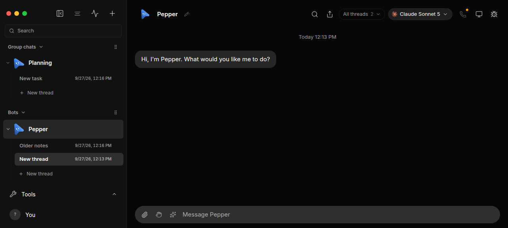
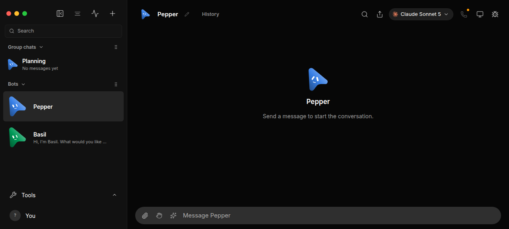
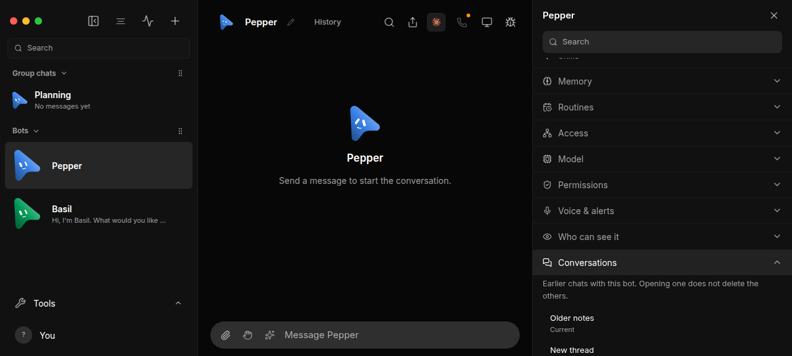
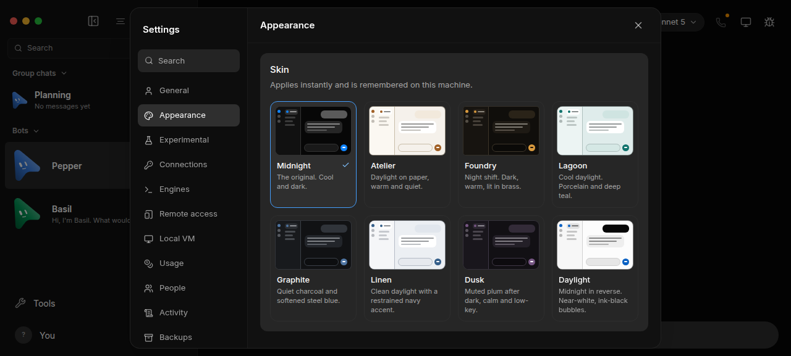

# Simple mode

Simple mode is a device-local preference that makes the everyday desktop UI
feel like a chat app: each bot is a contact with one ongoing conversation, and
thread management stays out of the main view. Engines, providers, MCP servers,
the virtual computer, rooms, and routines stay available. The preference
defaults off, so the existing UI is unchanged until someone turns it on.

Turn it on at **Settings → Appearance → Simple mode**. The switch is stored
only in this browser (`localStorage` key `jlfbot-simple-mode`, value `"1"`).
While it is on, **Show threads** is disabled and looks off; turning Simple
mode off restores that choice. Nothing is deleted.

Screenshots below are from the isolated renderer harness
(`node --experimental-strip-types scripts/control-jlfbot.ts ui launch`), not
from a live account.

## Phase 1 — this change

### One chat per bot

**Today.** `Sidebar` bot and room rows expand into `BotThreadList` /
`GroupThreadList`. The chat header shows `TaskPicker` (“All threads”) and a
new-thread action. `select` keeps whatever thread is already current.

**Change.** Clicking a bot or room in the sidebar (`openBotTarget` /
`openRoomTarget` in `src/lib/simple-mode-open.ts`) opens the newest live
thread: `updatedAt`, else `createdAt` (`threadRecency`). Archived threads and
routine runs are skipped. A tie keeps the thread already on screen. The
sidebar hides thread rows, folder controls, new-thread, and the bot context
menu’s new-thread / new-folder items. `TaskPicker`, `BotActivityPicker`, and
`GroupTaskPicker` return nothing. Older threads stay in a **History** control:
bots open Bot settings → **Conversations** (`ConversationHistory.tsx`); rooms
open the same list in a dialog, because rooms have no settings accordion.
Direct-message rooms and rooms still in setup do not get that button. The
list never creates or deletes a thread. The attention bell, deep links, and
History → Open still jump to a specific thread.

Opening that conversation marks it read (`POST /api/bots/:id/tasks/:threadId`
clears that task’s `unread` and recomputes the bot badge; a room switch
clears the room’s single `unread` flag). Sibling bot threads keep theirs.

**Long threads.** No new summarizer. The server already compacts a long
direct conversation before the next turn (`compactConversation` in
`server/index.ts`; see `docs/verification/context-compaction.md`). The
transcript, branches, and attachments stay; the chat shows a `DigestChip`
(“Earlier context summarized”). `context.autoCompact: false` turns that off.
Opening a long thread does not itself compact.

**Size.** One preference module, sidebar and header gates, one history
component, a settings section, and a small unread clear on the existing
switch routes.

### Clean sidebar

**Today.** With threads shown, each bot nests folders and threads, and a
collapsed bot can still show `SidebarBotActivity`. Rooms nest threads. A
pinned `SidebarAttentionPanel` lists threads that need you. Unread and
working dots already exist on the contact row.

**Change.** Simple mode hides those nested rows and the pinned attention
panel. Unread dots and working / waiting / queued presence stay on the
contact. Search, team sections, the Active Threads bell, profile, and the
new-bot / new-room actions stay. The existing “Show threads” off state is
narrower: it still shows activity rows and room thread lists. Simple mode
hides those too.

Last-activity ordering of the contact list is not in this phase. Rows stay in
the current section order.

**Size.** Conditionals in `Sidebar.tsx` and `TaskPicker.tsx`.

## Later phases

These are not in this pull request.

### Info pane (brief §3)

**Today.** The chat header already opens bot settings from the avatar, and
`Bot's computer` / `Inspector` are separate header buttons. Routines live
under the sidebar’s More menu (`showRoutines`). Room members and the bulletin
live in room settings, not a slide-over.

**Change.** A closed-by-default right pane, toggled from the contact name:
computer thumbnail, that bot’s routines, connected channels, and room
members. A gear in the pane opens the existing bot settings (including the
model, once settings consolidation lands). Reuse the current computer,
routine, and member views rather than a second data model.

**Size.** Medium. New layout shell and a few existing panels moved into it.
Easy to get wrong if it duplicates bot settings.

### Settings consolidation (brief §4)

**Today.** App settings already has many sections (`SettingsModal.tsx`):
General, Appearance, Engines, Connections, Local VM, Usage, and others.
Per-bot engine and model stay in the chat header (`ModelPicker`) and in bot
settings. API keys and custom MCP servers already live in settings, not in
the thread list.

**Change.** Fewer everyday tabs (General, Computer, Usage, Updates) with
Appearance, notifications, and language grouped under General. Keep engines,
providers (including custom OpenAI-compatible ones such as DeepSeek), API
keys, MCP servers, and model capability toggles in settings. Move the header
model picker into per-bot settings so the chat header is name + history.

**Size.** Large. Many sections and remote-client gates. Do not hide a power
feature that has no new home.

### Command palette (brief §5)

**Today.** `CommandPalette.tsx` opens with Cmd/Ctrl-K and ranks visible bots
and rooms. It filters out `hidden` bots and does not jump to a settings row.

**Change.** Include hidden bots, and add setting destinations so a message
can deep-link “turn on X”. Right-click Delete (with confirm) and hiding a bot
already exist on the sidebar; the palette is how a hidden bot comes back.

**Size.** Small to medium. Extend the existing palette; do not replace it.

### Visual polish (brief §2 and §5)

**Today.** Messages already render markdown, images, attachments, and
`QuestionCard` / `ApprovalCard`. The composer attaches files. Stop and a
working indicator exist. Speak-aloud exists; a composer microphone does not.
The message type has `reactions`, with no tapback control in the transcript.
Reply-in-thread under one message is not a separate surface. The app already
has a theme and accent (`SkinPicker`).

**Change.** Calmer spacing and one accent, only after the structure above is
in place. Status and errors as short chat lines instead of log panels.
Emoji tapbacks and a composer voice control if they are still missing.
Do not restyle the whole app in the same change as the structure.

**Size.** Large, and easy to fight the current theme. Separate from Phase 1.
